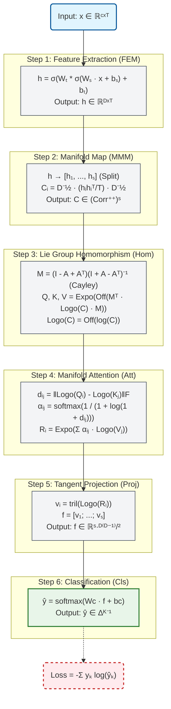
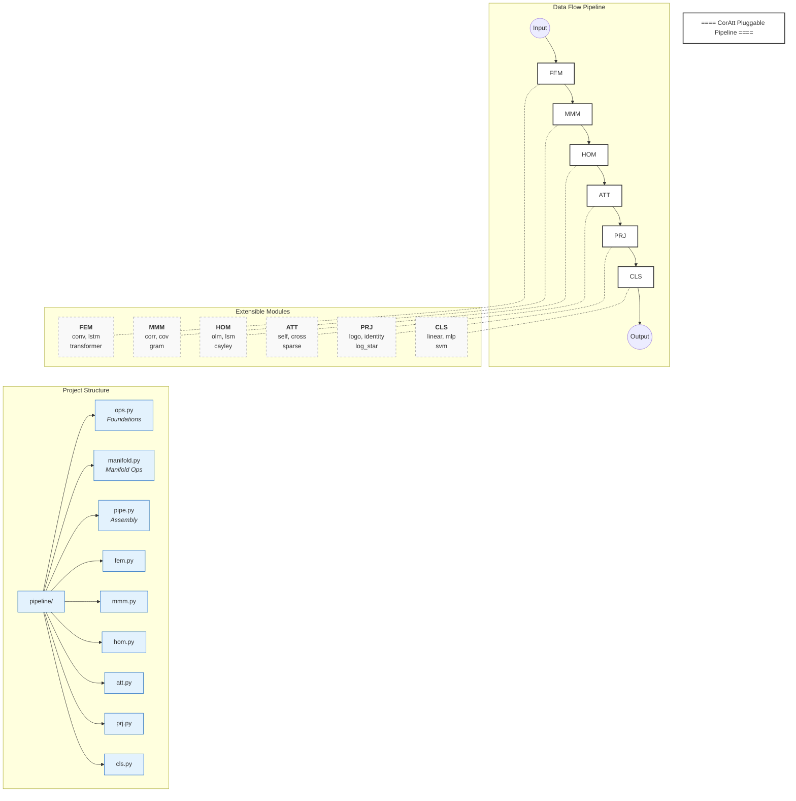
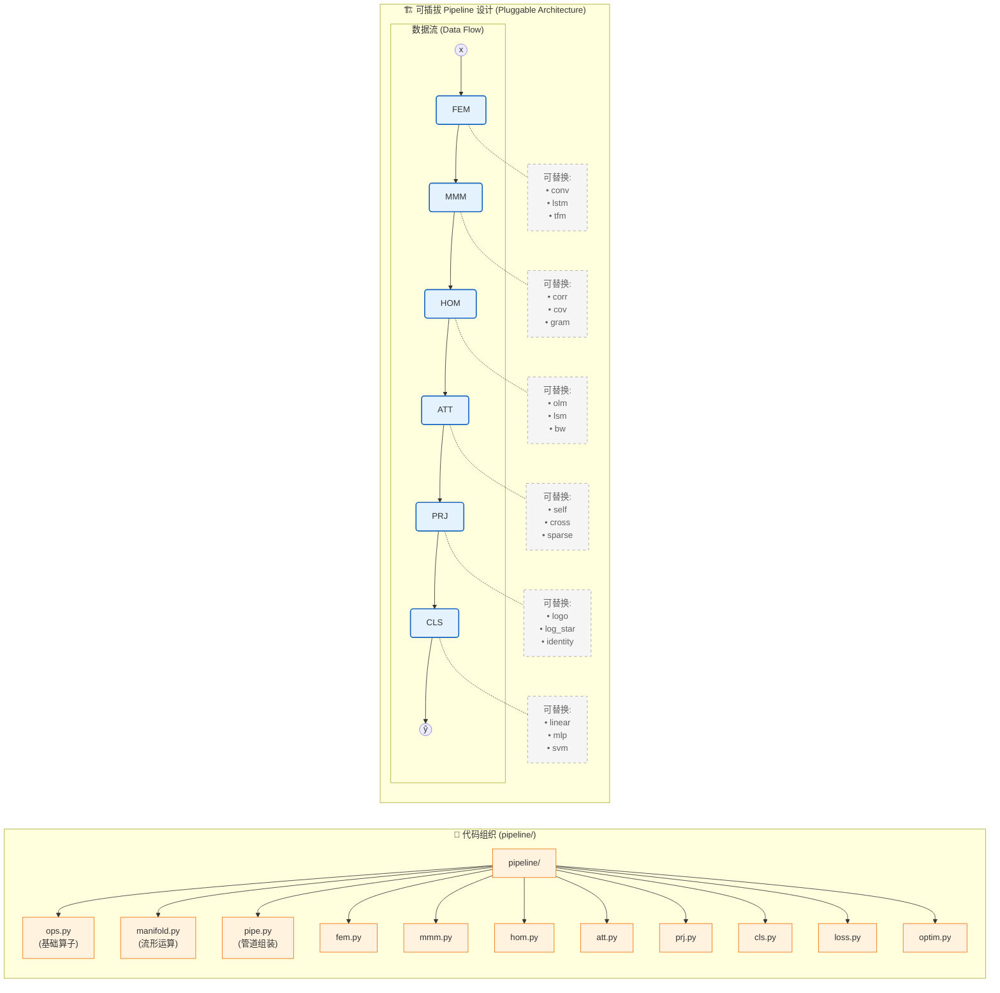

## CorAtt: Correlation Manifold Self-Attention Network

### 0. 数学符号表 (Mathematical Notation)

| 符号 | 含义 | 维度 |
|------|------|------|
| $x$ | EEG 输入信号 | $\mathbb{R}^{C \times T}$ |
| $h$ | 特征表示 | $\mathbb{R}^{D \times T}$ |
| $C_i$ | 第 $i$ 段的相关矩阵 | $\text{Corr}^{++}_D$ |
| $Q, K, V$ | 查询、键、值矩阵 | $(\text{Corr}^{++}_D)^S$ |
| $R_i$ | 注意力聚合结果 | $\text{Corr}^{++}_D$ |
| $f$ | 展平特征向量 | $\mathbb{R}^{S \cdot D(D-1)/2}$ |
| $\hat{y}$ | 预测概率 | $\Delta^{K-1}$ |

---

### 1. CorAtt 数学工作流 (Mathematical Workflow)

#### 完整前向传播公式

**Step 1: 特征提取 (FEM)**

$$
h = \sigma(W_t * \sigma(W_s \cdot x + b_s) + b_t)
$$

其中：
- $W_s \in \mathbb{R}^{D \times C}$: 空间卷积权重
- $W_t \in \mathbb{R}^{D \times k}$: 时间卷积核
- $\sigma$: ELU 激活函数

**Step 2: 流形映射 (MMM)**

$$
C_i = D^{-1/2} P_i D^{-1/2}, \quad P_i = \frac{1}{T_s - 1} h_i h_i^\top
$$

其中 $h = [h_1, ..., h_S]$ 是时间分段，$D = \text{diag}(\sqrt{\text{diag}(P_i)})$

**Step 3: 李群同态 (Hom)**

$$
\text{hom}(C; A) = \text{Expo}(\text{Off}(M^\top \cdot \text{Logo}(C) \cdot M))
$$

其中：
- $M = \text{Cayley}(A) = (I - S)(I + S)^{-1}, \quad S = A - A^\top$
- $\text{Logo}(C) = \text{Off}(\log C)$
- $\text{Expo}(S) = \exp(S + D^\circ)$, $D^\circ$ 由固定点迭代求解

**Step 4: 流形注意力 (Att)**

$$
\begin{aligned}
d_{ij} &= \|\text{Logo}(Q_i) - \text{Logo}(K_j)\|_F \\
s_{ij} &= \frac{1}{1 + \log(1 + d_{ij})} \\
\alpha_{ij} &= \text{softmax}_j(s_{ij}) \\
R_i &= \text{Expo}\left(\sum_j \alpha_{ij} \cdot \text{Logo}(V_j)\right)
\end{aligned}
$$

**Step 5: 切空间投影 (Proj)**

$$
v_i = \text{tril}(\text{Logo}(R_i)), \quad f = [v_1; \ldots; v_S]
$$

**Step 6: 分类 (Cls)**

$$
\hat{y} = \text{softmax}(W_c \cdot f + b_c)
$$

---

#### 流程图

---

### 2. 训练工作流 (Training Workflow)

#### 数学描述

**目标函数**

$$
\min_{\theta} \mathcal{L}(\theta) = \frac{1}{N} \sum_{i=1}^N \ell(f_\theta(x_i), y_i)
$$

其中交叉熵损失：

$$
\ell(\hat{y}, y) = -\log(\hat{y}_y) = -z_y + \log\sum_{k=1}^K e^{z_k}
$$

**Adam 优化器**

$$
\begin{aligned}
m_t &= \beta_1 m_{t-1} + (1-\beta_1) g_t \\
v_t &= \beta_2 v_{t-1} + (1-\beta_2) g_t^2 \\
\hat{m}_t &= m_t / (1 - \beta_1^t) \\
\hat{v}_t &= v_t / (1 - \beta_2^t) \\
\theta_t &= \theta_{t-1} - \eta_t \cdot \hat{m}_t / (\sqrt{\hat{v}_t} + \epsilon)
\end{aligned}
$$

**余弦学习率衰减**

$$
\eta_t = \eta_{\min} + \frac{1}{2}(\eta_{\max} - \eta_{\min})\left(1 + \cos\left(\frac{\pi t}{T}\right)\right)
$$

#### 函数式训练范式

训练循环完全函数化，使用 `jax.lax.scan` 替代命令式 for 循环：

$$
(\theta_T, s_T) = \text{scan}(f_{\text{step}}, (\theta_0, s_0), \{(x_b, y_b)\}_{b=1}^B)
$$

其中单步更新函数：

$$
f_{\text{step}}(s, \mathcal{B}) = (s', \text{loss})
$$

---

### 2. 可插拔 Pipeline 设计 (Pluggable Architecture)

这个图结合了横向的 Pipeline 流程和树状的文件结构。为了保持 README 的整洁，我将“模块流”和“代码结构”分为了左右（或上下）逻辑清晰的部分。

